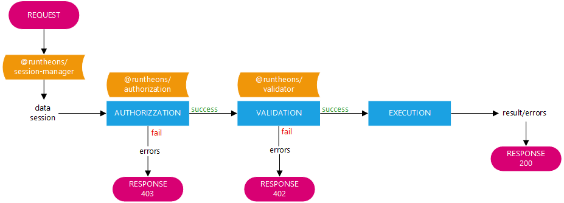
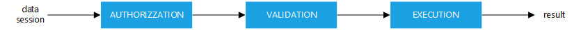
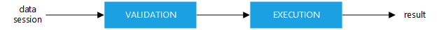
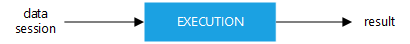

# Runtheons Router

npm package to manage the api endpoint

# Index

- [Introduction](https://github.com/Runtheons/runtheons-router#introduction)
- [References](https://github.com/Runtheons/runtheons-router#references)
- [Getting started](https://github.com/Runtheons/runtheons-router#getting-started)
  - [Prerequisites](https://github.com/Runtheons/runtheons-router#prerequisites)
  - [Installation](https://github.com/Runtheons/runtheons-router#installation)
- [Use](https://github.com/Runtheons/runtheons-router#use)
  - [Router](https://github.com/Runtheons/runtheons-router#router)
    - [loadRoutes](https://github.com/Runtheons/runtheons-router#loadRoutes)
  - [Route](https://github.com/Runtheons/runtheons-router#route)
  - [Requiring a Route function](https://github.com/Runtheons/runtheons-router#requiring-a-route-function)
    - [With authorizzation and validation](https://github.com/Runtheons/runtheons-router#with-authorizzation-and-validation)
  - [With only validation](https://github.com/Runtheons/runtheons-router#with-only-validation)
  - [Alone](https://github.com/Runtheons/runtheons-router#alone)

# Introduction

This repository contains the source code and official documentation of api endpoint router system. If the aforementioned documentation is not clear or contains errors, please report it immediately to the email address **bugs-documentation@runtheons.com** or report the issue here on GitHub. Please be extremely clear and precise in the description of the issue so that moderators can correct it as soon as possible.

# References

This project use:

- [**Runtheons Validator**](https://github.com/Runtheons/runtheons-validate#readme)
- [**Runtheons Authorizzation**](https://github.com/Runtheons/runtheons-authorizzation#readme)
- [**Runtheons Session Manager**](https://github.com/Runtheons/runtheons-session-manager#readme)
- [**Runtheons Utils**](https://github.com/Runtheons/runtheons-utils#readme)

# Getting started

## Prerequisites

1. Git
2. Node: any 14.x version starting with v14.5.0 or greater

## Installation

1. `npm install https://github.com/Runtheons/runtheons-router#v2.3.2` to add the package to the project

# Use

## Router

Router is the main class that manage the server, in your index file, you have to require the library passing `Express.app`, then you have to call `loadRoutes` method

### loadRoutes

```javascript
void Router.loadRoutes(string dirpath)
void Router.loadRoutes(string[] dirpaths)
```

## Route

This class define a Route, if Route is `available` it will load from Router, when the call match the `path` and `method` it well be resolve

Here the schema of how does it work when it's call from API



Here and example of creation

```javascript
const Route = require('@runtheons/router/Route');
const Authorizzation = require('../../Authorizzation');
const Validator = require('@runtheons/validate/Validator');

module.exports = new Route({
	path: '/sum',
	method: 'POST',
	avalaible: true,
	auth: [Authorizzation.LOGGED],
	schema: {
		num1: {
			type: Validator.INTEGER
		},
		num2: {
			type: Validator.INTEGER
		}
	},
	functionHandle: function ({ data }) {
		return data.num1 + data.num2;
	},
	notAuthorizedHandle: function (err) {
		console.log(err);
	},
	notValidDataHandle: function (err) {
		console.log(err);
	},
	successHandle: function (data) {
		console.log(data);
	},
	sendResponse: function ({ req, res, responseData }) {
		res.status(200);
		res.json(responseData.data);
	}
});
```

As you can see, in constructor you can pass many parameters, here the list

| Name                | Type                                                  | Description                                                                                                         |
| ------------------- | ----------------------------------------------------- | ------------------------------------------------------------------------------------------------------------------- |
| available           | boolean                                               | Define if the route is available (default: true)                                                                    |
| path                | string                                                | Define the route path                                                                                               |
| method              | string                                                | Define the route method (default: GET)                                                                              |
| auth                | AuthorizzationRecord[]                                | See [@runtheons/authorizzation](https://github.com/Runtheons/runtheons-authorizzation) for more details             |
| schema              | object                                                | Define the route schema See [@runtheons/validate](https://github.com/Runtheons/runtheons-validate) for more details |
| functionHandle      | object function({ data, session, req, responseData }) | It's execute on Route call, after validate, it has to return the data                                               |
| notAuthorizedHandle | void function(err)                                    | It's execute if the Request doesn't pass the authorizzation level                                                   |
| notValidDataHandle  | void function(err)                                    | It's execute if the Request doesn't pass the validation level                                                       |
| successHandle       | void function(data)                                   | It's execute after the Rotue execution                                                                              |
| sendResponse        | void function({ req, rew, responseData })             | In this function you have to send the resonse, by default send status 200 with data in responseData.data as a JSON  |

## Requiring a Route function

In other Route, you may need to use an alredy defined function, so you can use the function with authorizzation and validation, with only validation, or alone

### With authorizzation and validation

In your Route you have to require the `authorize` function passing all needed paramenter and your session

```javascript
async authorize({ data, session, req, responseData }) : responseData

responseData: {
	status: boolean,
	data: // from functionHandle
	authorization:{
		status: boolean,
		errors: {}[]
	},
	validation:{
		status: boolean,
		errors: {}[]
	}
}
```

Here and example

```javascript
const Route = require('@runtheons/router/Route');

module.exports = new Route({
	path: '/calcsum',
	method: 'GET',
	avalaible: true,
	auth: [],
	schema: {},
	functionHandle: async function ({ session, req }) {
		const api = require('./sum.js');
		const sum = await api.authorize({
			data: { num1: 4, num2: 5 },
			session,
			req
		});
		if (!sum.status) {
			return sum.errors;
		}
		return sum.data;
	}
});
```

So the flow will be



### With only validation

In your Route you have to require the `validate` function passing all needed paramenter and your session

```javascript
async validate({ data, session, req, responseData }) : responseData

responseData: {
	status: boolean,
	data: // from functionHandle
	validation:{
		status: boolean,
		errors: {}[]
	}
}
```

Here and example

```javascript
const Route = require('@runtheons/router/Route');

module.exports = new Route({
	path: '/calcsum',
	method: 'GET',
	avalaible: true,
	auth: [],
	schema: {},
	functionHandle: async function ({ session, req }) {
		const api = require('./sum.js');
		const sum = await api.validate({
			data: { num1: 4, num2: 5 },
			session,
			req
		});
		if (!sum.status) {
			return sum.errors;
		}
		return sum.data;
	}
});
```

So the flow will be



### Alone

In your Route you have to require the `functionHandle` function passing all needed paramenter and your session

```javascript
async functionHandle({ data, session, req, responseData }) : responseData

responseData: {
	status: boolean,
	data: // from functionHandle
}
```

Here and example

```javascript
const Route = require('@runtheons/router/Route');

module.exports = new Route({
	path: '/calcsum',
	method: 'GET',
	avalaible: true,
	auth: [],
	schema: {},
	functionHandle: async function ({ session, req }) {
		const api = require('./sum.js');
		const sum = await api.functionHandle({
			data: { num1: 4, num2: 5 },
			session,
			req
		});
		if (!sum.status) {
			return sum.errors;
		}
		return sum.data;
	}
});
```

So the flow will be


